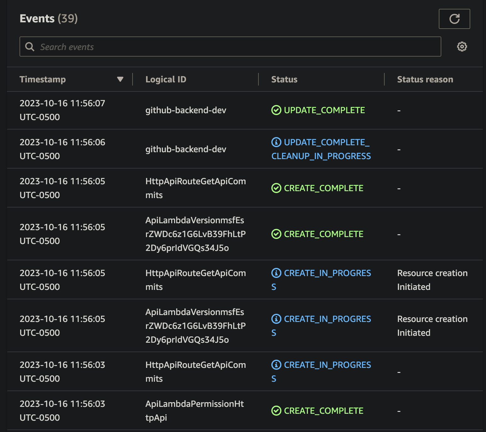

# Github Backend Lambda App

### Configuración inicial - Comandos a ejecutar

Clonar el repositorio para empezar a utilizar la aplicación. Hay que tener instalado [Nodejs](https://nodejs.org/en) y [Serverless](https://www.npmjs.com/package/serverless) de manera global si se quiere probar en local:

```
npm install -g serverless
```

Una vez completada la instalación ingresar a la carpeta y ejecutar el comando:

```
npm install
```

##### El package.json del proyecto cuenta con los siguientes comandos:

1. Comando para compilar TypeScript y generar el build de la aplicación:
   ```
   npm start
   ```
2. Comando para ejecutar los test de la aplicación en un entorno local:
   ```
   npm test
   ```
3. Comando para ejecutar la aplicación en un entorno local:
   ```
   npm run local
   ```

### Documentación Postman

https://documenter.getpostman.com/view/3273833/2s9YR6cEg8

---

### Despliegue en AWS



#### Endpoints:

##### GET: https://grhrdrb9v0.execute-api.us-east-1.amazonaws.com/api/commits

#### Functions:

     api: github-backend-dev-api (53 MB)
